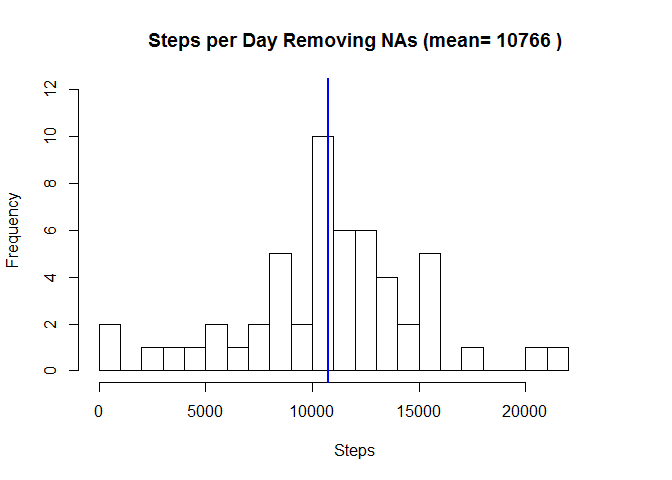
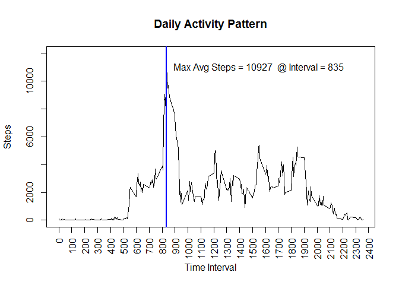
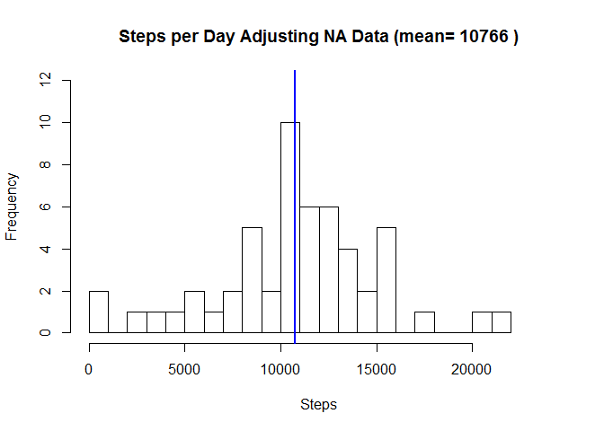
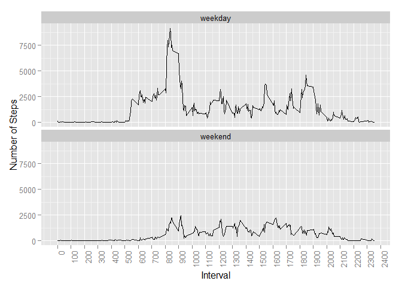

# Reproducible Research: Peer Assessment 1

## 1 Loading and preprocessing the data

 - Read in the dataset
 - Remove incomplete rows
 - Convert the Data field to a Date Object (Factor object -> "character string" -> Date object)
 - Setup the Figures directory
 - Review the data:


```r
        myData <- read.csv("activity.csv", na.strings = "NA", header = TRUE)
        myData <- subset(myData, steps != "NA")  ## remove rows with "Not Available" data
        myData <- as.data.frame(lapply(myData,function (y) if(class(y)=="factor" ) as.character(y) else y),stringsAsFactors=F)
        myData$date <- as.Date(substr(myData$date,1,10), "%Y-%m-%d") ## Convert character Date to Date object
        knitr::opts_chunk$set(fig.path='Figures/')
        strMyData <- str(myData)
```

```
## 'data.frame':	15264 obs. of  3 variables:
##  $ steps   : int  0 0 0 0 0 0 0 0 0 0 ...
##  $ date    : Date, format: "2012-10-02" "2012-10-02" ...
##  $ interval: int  0 5 10 15 20 25 30 35 40 45 ...
```


## 2 What is mean total number of steps taken per day?


```r
        byDay<-split(myData,myData$date, drop=TRUE)
        byDay <- sapply(byDay, function(x) sum(x$steps))  

        byDayMean <- aggregate(myData$steps, by=list(myData$date), FUN=mean)
        names(byDayMean) <- c("Date", "AverageNoSteps")

        myTitle <- paste("Steps per Day Removing NAs (mean=", round(mean(byDay, na.rm = TRUE), digits = 0), ")" )
        histInfo <- (hist(byDay, breaks=25, main = myTitle, xlab = "Steps", xlim=c(0,24000), ylim=c(0, 12)))
        abline(v = mean(byDay, na.rm = TRUE), col = "blue", lwd = 2)
```

 

```r
        summary(byDay)
```

```
##    Min. 1st Qu.  Median    Mean 3rd Qu.    Max. 
##      41    8841   10760   10770   13290   21190
```

## 3 What is the average daily activity pattern?


```r
        byInterval <- aggregate(myData$steps, by=list(myData$interval), FUN=sum)
        names(byInterval) <- c("Interval", "AverageNoSteps")
        index <- with(byInterval, order(byInterval$AverageNoSteps, decreasing = TRUE))
        myTitle <- "Daily Activity Pattern"
        plot(byInterval$Interval, byInterval$AverageNoSteps, main = myTitle, type="l", ylim=c(0,12000), pch="|", xlab = "Time Interval", ylab = "Steps", xaxt="n")
        axis(1, at = seq(0, 2400, by = 100), las=2)
        abline(v = byInterval[index,][1,1], col = "blue", lwd = 2 )
        myLineAnnotation <- paste("Max Avg Steps =", round(byInterval[index,][1,2], digits=0), " @ Interval =", byInterval[index,][1,1])
        text(1550, 11000, myLineAnnotation)
```

 

```r
        summary(byInterval)
```

```
##     Interval      AverageNoSteps   
##  Min.   :   0.0   Min.   :    0.0  
##  1st Qu.: 588.8   1st Qu.:  131.8  
##  Median :1177.5   Median : 1808.0  
##  Mean   :1177.5   Mean   : 1981.3  
##  3rd Qu.:1766.2   3rd Qu.: 2800.2  
##  Max.   :2355.0   Max.   :10927.0
```

## 4 Inputing missing values

The activity data contained missing steps values reported as NA in the dataset. The strategy to use and include this data is:

 - Located the steps fields with missing data (NA)
 - Update the steps field data with the average steps per day
 
The purpose of this exercise is to determine if including this information has an affect on the mean and median statistics when missing
data is *NOT* included.


```r
        myData2 <- read.csv("activity.csv", na.strings = "NA", header = TRUE)
        myData2 <- as.data.frame(lapply(myData2,function (y) if(class(y)=="factor" ) as.character(y) else y),stringsAsFactors=F)
        myData2$date <- as.Date(substr(myData2$date,1,10), "%Y-%m-%d")
        
        rowTotal1 <- nrow(myData2)
        rowComplete1 <- as.integer(sum(as.numeric(complete.cases(myData2))))
        rowDiff1 <- rowTotal1-rowComplete1
        rowStepsWithNA1 <- sum(as.numeric(is.na(myData2$steps)))
        
        for(i in 1:nrow(myData2)){
                if (is.na(myData2$steps[i])) {
                        if (length(byDayMean$AverageNoSteps[byDayMean$Date == myData2$date[i]]) != 0) {
                                myData2$steps[i] <- byDayMean$AverageNoSteps[byDay$Date == myData2$date[i]]
                        }
                        else { myData2$steps[i] = 0 }                        
                }
        }
        
        rowTotal2 <- nrow(myData2)
        rowComplete2 <- as.integer(sum(as.numeric(complete.cases(myData2))))
        rowDiff2 <- rowTotal2-rowComplete2
        rowStepsWithNA2 <- sum(as.numeric(is.na(myData2$steps)))
        
        byDayAfter<-split(myData,myData$date, drop=TRUE)
        byDayAfter <- sapply(byDayAfter, function(x) sum(x$steps))  
        myTitle <- paste("Steps per Day Adjusting NA Data (mean=", round(mean(byDayAfter), digits = 0), ")" )
        histInfo <- (hist(byDayAfter, breaks=25, main = myTitle, xlab = "Steps", xlim=c(0,24000), ylim=c(0, 12)))
        abline(v = mean(byDayAfter, na.rm = TRUE), col = "blue", lwd = 2)
```

 

```r
        summary(byDayAfter) 
```

```
##    Min. 1st Qu.  Median    Mean 3rd Qu.    Max. 
##      41    8841   10760   10770   13290   21190
```

Data statistics *before* adjusting for missing values (ignoring missing values) - 
        
        - Number of incomplete rows:  total number of rows - number of complete rows = 17568 - 15264 = 2304  
        - Number of rows with 'steps == NA':  2304
        - Average steps :  1.077\times 10^{4} 
        - Median steps :  1.076\times 10^{4} 
        
        Data statistics *after* adjusting missing values - 
                
        - Number of incomplete rows:  total number of rows - number of complete rows = 17568 - 17568 = 0  
        - Number of rows with 'steps == NA':  0
        - Average steps :  1.077\times 10^{4}  
        - Median steps :  1.076\times 10^{4} 
        
The mean and median are the same for both datasets, not including missing data has no affect on the dataset's mean and median statistics.

## 5 Differences in activity patterns between weekdays and weekends


```r
        myData2$timeframe <- ifelse((weekdays(myData2$date) == c("Saturday")) | (weekdays(myData2$date) == c("Sunday")),"weekend", "weekday")
        myData2$timeframe <- factor(myData2$timeframe)
        
        byInterval <- aggregate(myData2$steps, by=list(myData2$interval, myData2$timeframe), FUN=sum)
        names(byInterval) <- c("Interval", "timeframe", "AverageNoSteps")
        index <- with(byInterval, order(byInterval$AverageNoSteps, decreasing = TRUE))
        
        library(ggplot2)
```

```
## Warning: package 'ggplot2' was built under R version 3.2.1
```

```r
        ggplot(byInterval, aes(byInterval$Interval, byInterval$AverageNoSteps)) +
                           xlab("Interval") +
                           ylab("Number of Steps") +
                           geom_line() +
                           scale_x_continuous(breaks = seq(0, 2400, by=100)) +
                           facet_wrap(~timeframe, nrow=2) + 
                           theme(axis.text.x = element_text(angle = 90, hjust = 1))
```

 

```r
        summary(byInterval)
```

```
##     Interval        timeframe   AverageNoSteps  
##  Min.   :   0.0   weekday:288   Min.   :   0.0  
##  1st Qu.: 588.8   weekend:288   1st Qu.:  50.0  
##  Median :1177.5                 Median : 671.5  
##  Mean   :1177.5                 Mean   : 990.6  
##  3rd Qu.:1766.2                 3rd Qu.:1429.0  
##  Max.   :2355.0                 Max.   :9130.0
```
