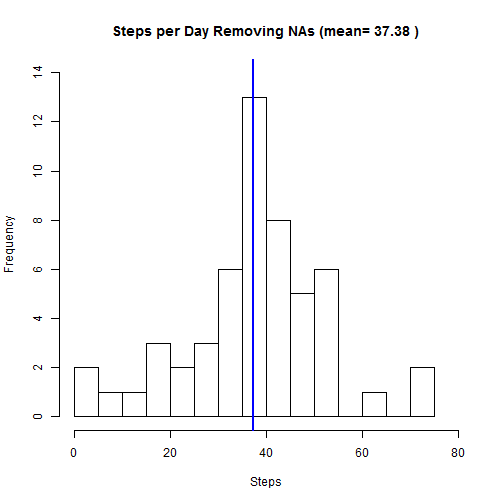
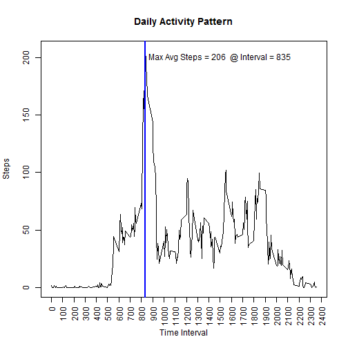
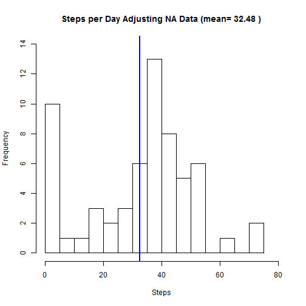
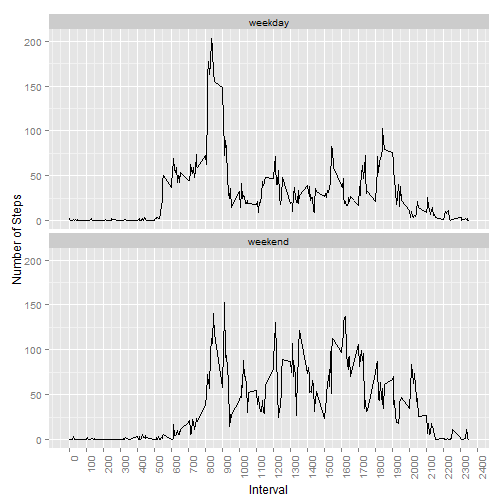

## 1 Loading and preprocessing the data


```r
  myData <- read.csv("activity.csv", na.strings = "NA", header = TRUE)
  myData <- subset(myData, steps != "NA")  ## remove rows with "Not Available" data
  myData <- as.data.frame(lapply(myData,function (y) if(class(y)=="factor" ) as.character(y) else y),stringsAsFactors=F)
  myData$date <- as.Date(substr(myData$date,1,10), "%Y-%m-%d") ## Convert character Date to Date object
  strMyData <- str(myData)
```

```
## 'data.frame':	15264 obs. of  3 variables:
##  $ steps   : int  0 0 0 0 0 0 0 0 0 0 ...
##  $ date    : Date, format: "2012-10-02" "2012-10-02" ...
##  $ interval: int  0 5 10 15 20 25 30 35 40 45 ...
```


## 2 What is mean total number of steps taken per day?


```r
  byDay <- aggregate(myData$steps, by=list(myData$date), FUN=mean)
  names(byDay) <- c("Date", "AverageNoSteps")
  myTitle <- paste("Steps per Day Removing NAs (mean=", round(mean(byDay$AverageNoSteps, na.rm = TRUE), digits = 2), ")" )
  histInfo <- (hist(byDay$AverageNoSteps, breaks=25, main = myTitle, xlab = "Steps", xlim=c(0,80), ylim=c(0, 14)))
  abline(v = mean(byDay$AverageNoSteps, na.rm = TRUE), col = "blue", lwd = 2)
```

 

```r
  summary(byDay)
```

```
##       Date            AverageNoSteps   
##  Min.   :2012-10-02   Min.   : 0.1424  
##  1st Qu.:2012-10-16   1st Qu.:30.6979  
##  Median :2012-10-29   Median :37.3785  
##  Mean   :2012-10-30   Mean   :37.3826  
##  3rd Qu.:2012-11-16   3rd Qu.:46.1597  
##  Max.   :2012-11-29   Max.   :73.5903
```

## 3 What is the average daily activity pattern?


```r
  byInterval <- aggregate(myData$steps, by=list(myData$interval), FUN=mean)
  names(byInterval) <- c("Interval", "AverageNoSteps")
  index <- with(byInterval, order(byInterval$AverageNoSteps, decreasing = TRUE))
  myTitle <- "Daily Activity Pattern"
  plot(byInterval$Interval, byInterval$AverageNoSteps, main = myTitle, type="l", pch="|", xlab = "Time Interval", ylab = "Steps", xaxt="n")
  axis(1, at = seq(0, 2400, by = 100), las=2)
  abline(v = byInterval[index,][1,1], col = "blue", lwd = 2 )
  myLineAnnotation <- paste("Max Avg Steps =", round(byInterval[index,][1,2], digits=0), " @ Interval =", byInterval[index,][1,1])
  text(1500, 200, myLineAnnotation)
```

 

```r
  summary(byInterval)
```

```
##     Interval      AverageNoSteps   
##  Min.   :   0.0   Min.   :  0.000  
##  1st Qu.: 588.8   1st Qu.:  2.486  
##  Median :1177.5   Median : 34.113  
##  Mean   :1177.5   Mean   : 37.383  
##  3rd Qu.:1766.2   3rd Qu.: 52.835  
##  Max.   :2355.0   Max.   :206.170
```

## 4 Inputing missing values


```r
        myData2 <- read.csv("activity.csv", na.strings = "NA", header = TRUE)
        myData2 <- as.data.frame(lapply(myData2,function (y) if(class(y)=="factor" ) as.character(y) else y),stringsAsFactors=F)
        myData2$date <- as.Date(substr(myData2$date,1,10), "%Y-%m-%d")
        
        rowTotal1 <- nrow(myData2)
        rowComplete1 <- as.integer(sum(as.numeric(complete.cases(myData2))))
        rowDiff1 <- rowTotal1-rowComplete1
        rowStepsWithNA1 <- sum(as.numeric(is.na(myData2$steps)))
        
        for(i in 1:nrow(myData2)){
                if (is.na(myData2$steps[i])) {
                        if (length(byDay$AverageNoSteps[byDay$Date == myData2$date[i]]) != 0) {
                                myData2$steps[i] <- byDay$AverageNoSteps[byDay$Date == myData2$date[i]]
                        }
                        else { myData2$steps[i] = 0 }                        
                }
        }
        
        rowTotal2 <- nrow(myData2)
        rowComplete2 <- as.integer(sum(as.numeric(complete.cases(myData2))))
        rowDiff2 <- rowTotal2-rowComplete2
        rowStepsWithNA2 <- sum(as.numeric(is.na(myData2$steps)))
        
        byDayAfter <- aggregate(myData2$steps, by=list(myData2$date), FUN=mean)
        myTitle <- paste("Steps per Day Adjusting NA Data (mean=", round(mean(byDayAfter$x, na.rm = TRUE), digits = 2), ")" )
        histInfo <- (hist(byDayAfter$x, breaks=25, main = myTitle, xlab = "Steps", xlim=c(0,80), ylim=c(0, 14)))
        abline(v = mean(byDayAfter$x, na.rm = TRUE), col = "blue", lwd = 2)
```

 

```r
        summary(byDayAfter)   
```

```
##     Group.1                 x        
##  Min.   :2012-10-01   Min.   : 0.00  
##  1st Qu.:2012-10-16   1st Qu.:23.53  
##  Median :2012-10-31   Median :36.09  
##  Mean   :2012-10-31   Mean   :32.48  
##  3rd Qu.:2012-11-15   3rd Qu.:44.48  
##  Max.   :2012-11-30   Max.   :73.59
```

  Data statistics *before* adjusting for missing values (ignoring missing values) - 

  - Number of incomplete rows:  total number of rows - number of complete rows = 17568 - 15264 = 2304  
  - Number of rows with 'steps == NA':  2304
  - Average steps :  37.38 
  - Median steps :  37.38 

  Data statistics *after* adjusting missing values - 
  
  - Number of incomplete rows:  total number of rows - number of complete rows = 17568 - 17568 = 0  
  - Number of rows with 'steps == NA':  0
  - Average steps :  32.48  
  - Median steps :  36.09  

## 5 Differences in activity patterns between weekdays and weekends


```r
        myData2$timeframe <- ifelse((weekdays(myData2$date) == c("Saturday")) | (weekdays(myData2$date) == c("Sunday")),"weekend", "weekday")
        myData2$timeframe <- factor(myData2$timeframe)
        
        byInterval <- aggregate(myData2$steps, by=list(myData2$interval, myData2$timeframe), FUN=mean)
        names(byInterval) <- c("Interval", "timeframe", "AverageNoSteps")
        index <- with(byInterval, order(byInterval$AverageNoSteps, decreasing = TRUE))
        
        library(ggplot2)
```

```
## Warning: package 'ggplot2' was built under R version 3.2.1
```

```r
        ggplot(byInterval, aes(byInterval$Interval, byInterval$AverageNoSteps)) +
                           xlab("Interval") +
                           ylab("Number of Steps") +
                           geom_line() +
                           scale_x_continuous(breaks = seq(0, 2400, by=100)) +
                           facet_wrap(~timeframe, nrow=2) + 
                           theme(axis.text.x = element_text(angle = 90, hjust = 1))
```

 

```r
        summary(byInterval)
```

```
##     Interval        timeframe   AverageNoSteps   
##  Min.   :   0.0   weekday:288   Min.   :  0.000  
##  1st Qu.: 588.8   weekend:288   1st Qu.:  1.617  
##  Median :1177.5                 Median : 22.817  
##  Mean   :1177.5                 Mean   : 34.160  
##  3rd Qu.:1766.2                 3rd Qu.: 54.531  
##  Max.   :2355.0                 Max.   :202.889
```
